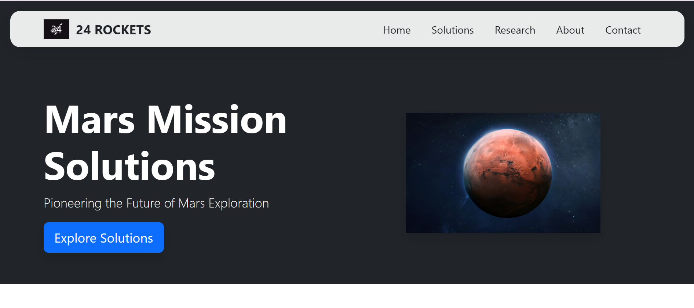
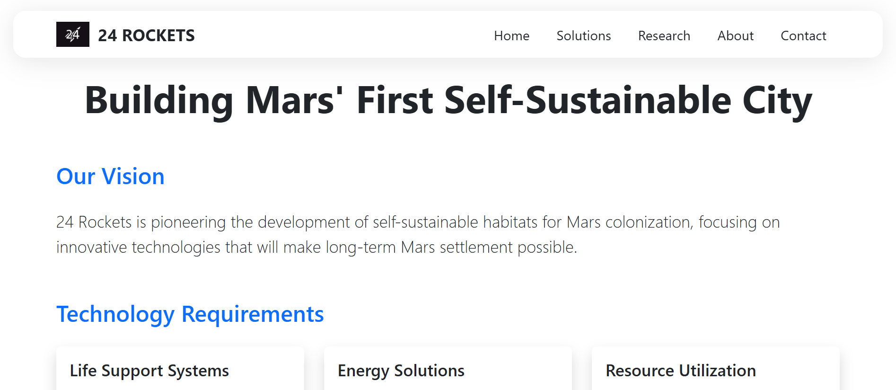
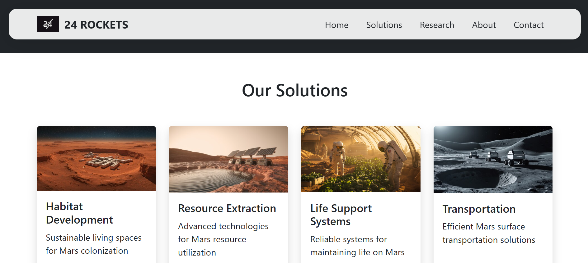
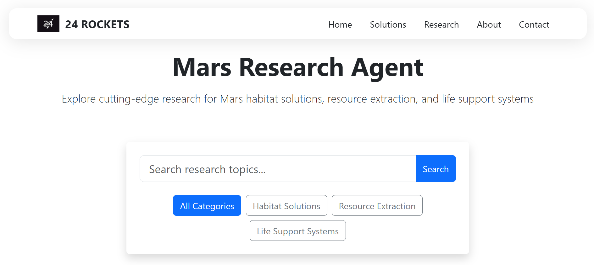

# Mars Colonization Reasearch 🚀

## 🔗 Live

Check out the live website [here](https://24rockets.cloud)!

## 🛠️ Tech Stack

- **Frontend:** React.Js

## 🌟 Features

- **Informative Content:** Learn about the requirements for human survival on Mars.
- **Interactive UI:** Modern and engaging design for an immersive user experience.
- **Visionary Insights:** Explore the future of Mars colonization and the role of technology.

## 📸 Live Images

  
  --------------------------------------------------------------------------------------------------------------------------------------------------------
  
  --------------------------------------------------------------------------------------------------------------------------------------------------------
  
  --------------------------------------------------------------------------------------------------------------------------------------------------------
  

## 🏆 Inspiration

Going to Mars is the most exciting endeavor for me. To save the human race, Mars should be colonized, and the person leading this vision is Elon Musk. This project is a tribute to the future of space exploration and human survival.

## 👨‍💻 Made by Me

This project is a result of my passion for space exploration and innovation. Feel free to connect with me:

- [Email](mailto:pradeepbangari24@gmail.com) - [LinkedIn](https://www.linkedin.com/in/pradeep-bangari24/)

## 🤝 Contributing

Contributions are welcome! If you'd like to contribute, please fork the repository and submit a pull request.

## 📜 License

This project is licensed under the MIT License. See the [LICENSE](LICENSE) file for details.

#ESCN

